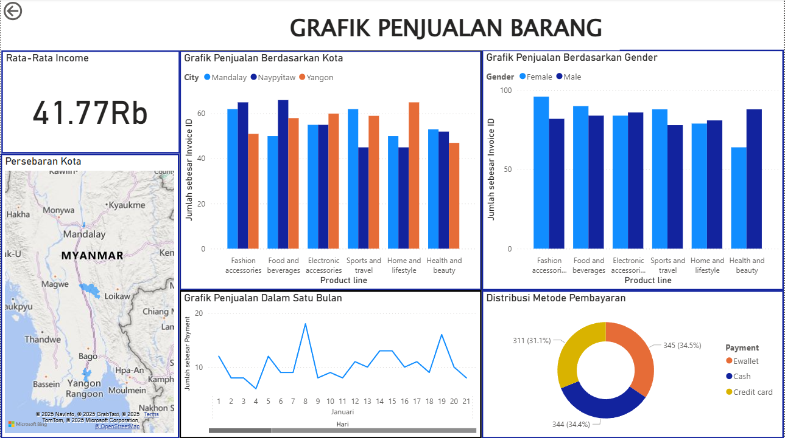

# 🛒 Power BI Dashboard: Grafik Penjualan Barang

Dashboard ini menampilkan visualisasi penjualan barang dari data supermarket yang telah dibersihkan. Analisis mencakup metrik penjualan berdasarkan kota, gender, metode pembayaran, dan tren harian selama bulan Januari.

## 📸 Preview Dashboard

---

## 📁 Struktur File

| File | Deskripsi |
|------|-----------|
| `Sales Chart.pbit` | Template dashboard Power BI dalam format `.pbit` |
| `Supermarket Sales Cleaned.csv` | Dataset bersih yang digunakan dalam visualisasi |
| `Screenshot 2025-08-04 200632.png` | Cuplikan tampilan dashboard |
| `README.md` | Dokumentasi proyek |

---

## 📊 Ringkasan Visualisasi

- **Rata-rata Income**  
  Menampilkan pendapatan rata-rata dari semua transaksi.

- **Grafik Penjualan Berdasarkan Kota**  
  Membandingkan jumlah invoice dari tiga kota utama: Mandalay, Naypyitaw, dan Yangon.

- **Grafik Penjualan Berdasarkan Gender**  
  Menganalisis pola pembelian antara pelanggan pria dan wanita berdasarkan kategori produk.

- **Peta Persebaran Kota**  
  Visualisasi lokasi geografis toko berdasarkan kota di Myanmar.

- **Grafik Penjualan Harian**  
  Menunjukkan tren transaksi selama 21 hari di bulan Januari.

- **Distribusi Metode Pembayaran**  
  Diagram donat yang memperlihatkan proporsi penggunaan metode pembayaran: Ewallet, Cash, dan Credit Card.

---

## 📌 Cara Menggunakan

1. **Buka file `Sales Chart.pbit` di Power BI Desktop**.
2. Jika diminta, **hubungkan ulang ke file `Supermarket Sales Cleaned.csv`** pada komputer lokal kamu.
3. Dashboard akan otomatis memuat visualisasi berdasarkan data tersebut.

---

## 📦 Requirements

- Power BI Desktop (versi terbaru)
- File `.csv` dengan struktur data seperti `Supermarket Sales Cleaned.csv`

---

## 🧠 Insight Singkat

- **Kota Yangon** dan **Mandalay** memiliki volume penjualan tertinggi.
- Pelanggan **wanita** menunjukkan frekuensi pembelian lebih tinggi dalam beberapa kategori.
- Metode pembayaran **Credit Card** sedikit lebih sering digunakan dibanding metode lainnya.

---
